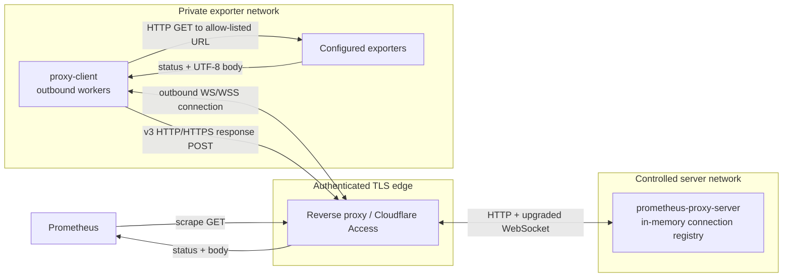
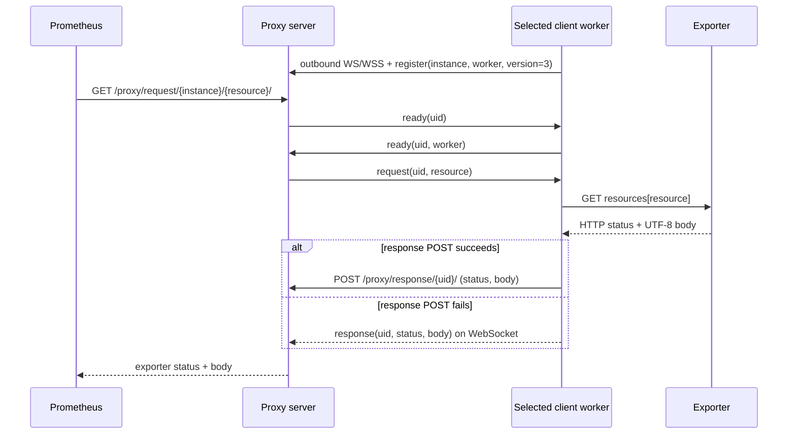

# Prometheus WebSocket Proxy Client

[](https://github.com/razortheory/prometheus-ws-proxy-client/actions/workflows/ci.yml)

`proxy-client` is the outbound agent for scraping Prometheus exporters in private
networks. It keeps one or more WebSocket connections to the proxy service,
accepts only configured resource names, performs the corresponding local HTTP
GET, and returns the exporter status and body.

The matching public-side component is
[prometheus-ws-proxy-server](https://github.com/razortheory/prometheus-ws-proxy-server).

## Why this exists

Prometheus normally needs an inbound path to every exporter. This pair reverses
that connection: the client dials out from the exporter network, so exporter
ports do not need to be exposed publicly. The public request contains an
instance and a logical resource name, never an arbitrary exporter URL.

## Architecture and trust boundaries



The edge is a required trust boundary, not part of either Rust binary. The
server has no built-in TLS or authentication. The client trusts the configured
proxy endpoint and the local `resources` map; Prometheus-facing input cannot
change an exporter URL.

## Wire-v3 scrape flow

The sequence below treats the edge and backend as one logical proxy endpoint;
the architecture diagram above shows the physical hop between them.



One worker handles one scrape at a time. `--parallel 3` creates three independent
connections and permits up to three concurrent exporter calls from this process.
Response headers are not transported.

## Wire compatibility

Product version and wire version are separate. This v3 client retains all three
historical wire modes so client and server migrations can be staged.

| `--protocol` | Worker selection | Response transport |
| --- | --- | --- |
| `1` | Server dispatches directly | WebSocket |
| `2` | `ready` handshake selects an idle worker | WebSocket |
| `3` (default) | `ready` handshake selects an idle worker | HTTP form POST, with WebSocket fallback |

Use the wire version supported by the server being contacted. The companion v3
Rust server accepts all three modes.

## Install a release

Releases contain a stripped, static Linux amd64 binary and a checksum:

```bash
VERSION=v3.0.1
BASE="https://github.com/razortheory/prometheus-ws-proxy-client/releases/download/${VERSION}"

curl -fLO "${BASE}/proxy-client-linux-amd64"
curl -fLO "${BASE}/proxy-client-linux-amd64.sha256"
sha256sum --check proxy-client-linux-amd64.sha256
sudo install -m 0755 proxy-client-linux-amd64 /usr/local/bin/proxy-client
proxy-client --version
```

The release binary uses musl and rustls; it does not depend on glibc or OpenSSL
at runtime. The host still needs a current CA certificate store when `https` or
`wss` endpoints are used.

## Configuration

Pass a JSON file as the positional argument. This local example pairs with the
server repository's `example.config.json` on port `8081`:

```json
{
  "instance": "host-a",
  "target": "ws://127.0.0.1:8081/proxy/",
  "resources": {
    "node": "http://127.0.0.1:9100/metrics"
  },
  "cf_access_enabled": false,
  "cf_access_key": "",
  "cf_access_secret": ""
}
```

The committed [`example.config.json`](./example.config.json) uses `wss` and
placeholder Cloudflare Access credentials, so it assumes a TLS-terminating edge.

| Field | Required | Default | Meaning |
| --- | --- | --- | --- |
| `instance` | yes | — | Public instance identifier. The special value `ec2` is resolved to the EC2 instance ID at startup. |
| `target` | yes | — | Proxy base URL or exact WebSocket endpoint. Accepted schemes: `http`, `https`, `ws`, `wss`. |
| `resources` | yes | — | Map of public resource names to exporter URLs. The client performs HTTP GET requests only. |
| `cf_access_enabled` | no | `false` | Add Cloudflare Access service-token headers when connecting and posting v3 responses. |
| `cf_access_key` | no | empty string | Value of `CF-Access-Client-Id`. |
| `cf_access_secret` | no | empty string | Value of `CF-Access-Client-Secret`. |
| `ec2_meta_domain` | no | `http://169.254.169.254` | EC2 metadata base URL used only when `instance` is `ec2`. |

An HTTP(S) base is normalized to `<base>/ws/` for WebSocket traffic and
`<base>/response/{uid}/` for wire-v3 responses. Supplying an exact `/ws` endpoint
also works. Query strings and fragments are discarded during normalization.

For `instance: "ec2"`, startup tries IMDSv2 first and falls back to IMDSv1. The
resolved instance ID is retained for the lifetime of the process. Instance IDs
are limited to 256 bytes and resource names to 512 bytes.

## Run

```text
proxy-client [OPTIONS] [CONFIG]
```

```bash
proxy-client /etc/prometheus-proxy/client.json \
  --parallel 3 \
  --protocol 3 \
  -v
```

| Option | Default | Notes |
| --- | --- | --- |
| `CONFIG` | `client_config.json` | JSON configuration path. |
| `-p`, `--parallel <N>` | `3` | Positive number of independent workers/connections. |
| `-r`, `--protocol <1|2|3>` | `3` | Historical wire protocol. |
| `-v`, `--verbose` | none | Repeat for `info`, `debug`, then `trace`; without it the default is `warn`. |
| `--sentry_dsn <DSN>` | unset | Enable Sentry error reporting. The underscore spelling is intentional for compatibility. |

`RUST_LOG` overrides the verbosity-derived filter. Debug and trace events from
HTTP/WebSocket transport crates remain suppressed so increasing verbosity does
not expose raw authentication headers.

SIGINT and SIGTERM start graceful shutdown. The process gives all workers a
shared 15-second deadline before exiting.

## Security model

- Run production traffic through a trusted TLS/authentication edge. Plain `ws`
  and `http` are suitable only inside a network where that transport is trusted;
  otherwise service-token headers and metrics travel in cleartext.
- Treat `resources` as privileged configuration. It is the SSRF boundary: remote
  requests select only map keys, while operators control the corresponding
  initial URLs. The HTTP client follows redirects, so redirect targets must also
  be trusted.
- Protect configuration files containing Cloudflare credentials with restrictive
  ownership and permissions; do not commit production values.
- Cloudflare credentials are attached to the WebSocket handshake and wire-v3
  response POST only when `cf_access_enabled` is true. Debug formatting redacts
  both values and logs resource names rather than their configured URLs.
- Keep exporters bound to private or loopback interfaces. This proxy removes the
  need for a public exporter listener; it does not authenticate the exporter.
- Enabling Sentry sends error telemetry to the configured external DSN; treat it
  as another explicit trust boundary.

## Operational behavior and limits

| Behavior | Bound |
| --- | --- |
| Exporter connect / total request timeout | 5 seconds / 60 seconds |
| Proxy WebSocket connect timeout | 10 seconds |
| Reconnect delay | 1 second after a disconnected attempt |
| Heartbeat | every 20 seconds; stale after 45 seconds without a pong |
| WebSocket send timeout | 5 seconds |
| Exporter body and WebSocket message | 64 MiB each |
| Shared response-memory budget | 256 MiB per process |
| Active exporter calls | one per worker |
| Busy-response queue | 8 entries; up to 4 concurrent v3 POST attempts |

The process does not build an unbounded scrape task pool. Increase `--parallel`
only when the expected scrape concurrency justifies the extra sockets and memory.

Important response behavior:

- unknown resource: `404` with `No such resource`;
- exporter connection, timeout, decoding, or size failure: `500` with an empty body;
- a second request delivered to an already-busy worker: `503` with an empty body;
- successful exporter calls: exporter status and UTF-8 body are preserved.

Wire-v3 delivery is transport-level at-least-once: if an HTTP response POST was
accepted but its reply was lost, the client can fall back to WebSocket with the
same UID. The companion server consumes pending UIDs once.

Configuration is loaded once at startup. Resource URL syntax is checked only
when that resource is requested; restart the process after changing the file.

## Development

The repository pins Rust `1.96.0`; `Cargo.toml` declares Rust `1.88` as the
minimum supported version. Cargo is configured to use `sccache`, so install
`sccache` `0.16.0` and keep it on `PATH`.

```bash
cargo +1.96.0 fmt --all -- --check
cargo +1.96.0 check --locked --all-targets --all-features
cargo +1.96.0 test --locked --all-targets --all-features
cargo +1.96.0 clippy --locked --all-targets --all-features -- -D warnings
cargo +1.88.0 check --locked --all-targets --all-features
cargo +1.88.0 test --locked --all-targets --all-features
```

Run directly from the checkout:

```bash
cargo +1.96.0 run --locked -- ./example.config.json --parallel 3 --protocol 3 -v
```

The example targets `wss://localhost:8081`; use a TLS edge for that value or
change it to `ws://127.0.0.1:8081/proxy/` for a direct local server.

## Build the Linux artifact with Docker

The Dockerfile produces an artifact stage, not a runtime image:

```bash
docker buildx build \
  --platform linux/amd64 \
  --target artifact \
  --output type=local,dest=dist \
  .

./dist/proxy-client-linux-amd64 --version
```

The builder downloads the pinned `sccache` release with checksum verification.
CI additionally passes optional GitHub Actions cache credentials as BuildKit
secrets.

## CI and releases

GitHub Actions checks formatting, tests, Clippy with warnings denied, Rust 1.88
MSRV, and the static Linux amd64 artifact. CI smoke-tests the artifact in an
Ubuntu 16.04 container. A `v*` tag must exactly match the Cargo package version;
the release workflow then runs the same artifact in Ubuntu 16.04, 18.04, 20.04,
22.04, 24.04, and 26.04 userspaces before publishing it and its SHA-256 file.

Those container checks validate userspace compatibility on the runner's kernel.
They are not proof that the binary runs on each distribution's historical
kernel, so Ubuntu 16 support remains provisional until verified on a real host
or VM.

## Related repository

- [prometheus-ws-proxy-server](https://github.com/razortheory/prometheus-ws-proxy-server) — accepts Prometheus requests and dispatches them to connected workers.

## License

No license file is currently included in this repository.
